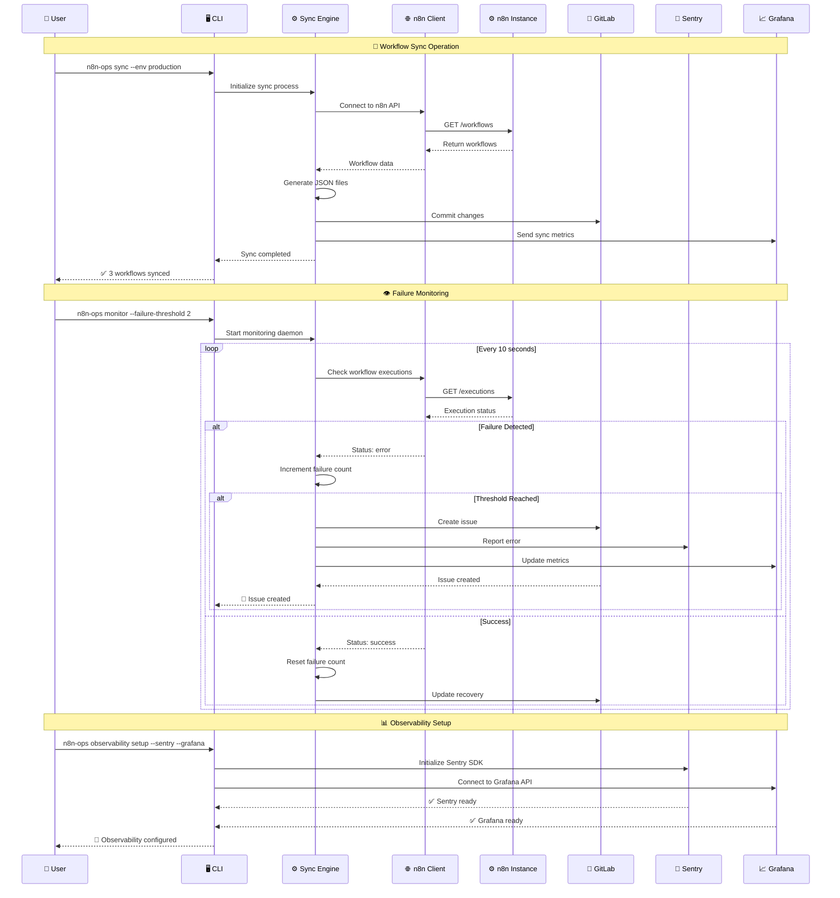
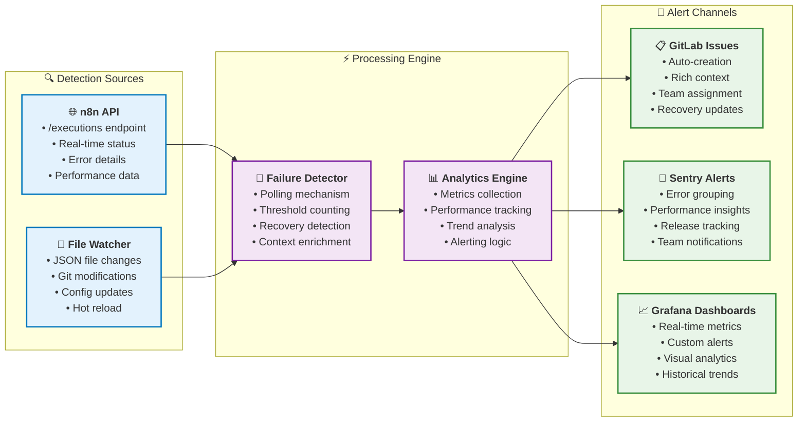

# n8n-ops Architecture - Complete System Overview

## 🏗️ Sistema Completo Implementado

```mermaid
graph TB
    %% User Interfaces
    subgraph "🎮 User Interfaces"
        CLI["`🖥️ **n8n-ops CLI**
        • Matrix ASCII Art
        • Robot Voice (TTS)
        • Multi-language (EN/ES)
        • 15+ Commands`"]
        
        WEB["`🌐 **Web UI** (Planned)
        • Dashboard
        • Real-time monitoring
        • GitLab integration`"]
    end

    %% Core Commands
    subgraph "⚡ Core Commands"
        SYNC["`🔄 **sync**
        • Bidirectional sync
        • Environment isolation
        • Auto-backup
        • Git integration`"]
        
        DEPLOY["`🚀 **deploy**
        • Intelligent alias
        • Zero-downtime
        • Multi-environment
        • Rollback support`"]
        
        MONITOR["`👁️ **monitor**
        • Real-time failure detection
        • Auto GitLab issues
        • Configurable thresholds
        • Recovery tracking`"]
        
        DAEMON["`🤖 **daemon**
        • File system watching
        • Auto-sync on changes
        • Background operation
        • Hot updates`"]
        
        OBSERV["`📊 **observability**
        • Sentry integration
        • Grafana dashboards
        • Enterprise monitoring
        • Performance tracking`"]
    end

    %% External Systems
    subgraph "🌍 External Systems"
        N8N["`⚙️ **n8n Instances**
        • Development (localhost:5678)
        • Staging (n8n-staging.com)
        • Production (n8n-prod.com)
        • Mock Server (localhost:3001)`"]
        
        GITLAB["`🦊 **GitLab Integration**
        • Issue Management
        • CI/CD Pipelines
        • Merge Requests
        • Project Collaboration`"]
        
        SENTRY["`🐛 **Sentry**
        • Error Tracking
        • Performance Monitoring
        • Context-rich alerts
        • Release tracking`"]
        
        GRAFANA["`📈 **Grafana**
        • Metrics Dashboards
        • Custom Alerts
        • Performance Analytics
        • Real-time visualization`"]
    end

    %% Internal Architecture
    subgraph "🏛️ Internal Architecture"
        subgraph "🔧 Core Engine"
            CLIENT["`🌐 **n8n Client**
            • REST API integration
            • SOLID principles
            • Context support
            • Error handling`"]
            
            SYNC_ENGINE["`⚙️ **Sync Engine**
            • Bidirectional sync
            • Metadata tracking
            • Conflict resolution
            • Git integration`"]
            
            MONITOR_ENGINE["`👁️ **Monitoring Engine**
            • Failure Detection
            • Polling mechanism
            • Threshold management
            • Recovery detection`"]
        end
        
        subgraph "🔐 Security & Config"
            CREDS["`🔑 **Credentials**
            • Environment isolation
            • Secure storage
            • API key management
            • Multi-environment`"]
            
            CONFIG["`⚙️ **Configuration**
            • YAML-based config
            • Environment variables
            • CLI flags
            • Defaults management`"]
        end
        
        subgraph "📊 Data Management"
            STORAGE["`💾 **Storage**
            • SQLite database
            • Metadata tracking
            • Backup management
            • Version history`"]
            
            WORKFLOW["`📋 **Workflow Management**
            • JSON validation
            • Template system
            • Execution tracking
            • Status monitoring`"]
        end
        
        subgraph "🔗 Integrations"
            GIT["`📚 **Git Integration**
            • Branch management
            • Commit tracking
            • Change detection
            • Repository sync`"]
            
            ISSUES["`📋 **Issue Management**
            • Auto-creation
            • Recovery updates
            • Context enrichment
            • Template generation`"]
            
            I18N["`🌍 **Internationalization**
            • Multi-language support
            • English & Spanish
            • Dynamic switching
            • Cultural adaptation`"]
        end
    end

    %% File System
    subgraph "📁 File System Structure"
        FS["`📂 **Project Structure**
        workflows/
        ├── development/
        ├── staging/
        └── production/
        
        config/
        ├── development.yaml
        ├── staging.yaml
        └── production.yaml
        
        backups/
        └── {timestamp}/`"]
    end

    %% Testing Infrastructure
    subgraph "🧪 Testing Infrastructure"
        TESTS["`✅ **Test Coverage (100%)**
        • 29 test files
        • 100+ test functions
        • Unit & integration tests
        • Mock implementations
        • Enterprise standards`"]
        
        MOCK["`🎭 **Mock Server**
        • n8n API simulation
        • Realistic failure scenarios
        • Demo mode support
        • Development testing`"]
    end

    %% Data Flow Connections
    CLI --> SYNC
    CLI --> DEPLOY
    CLI --> MONITOR
    CLI --> DAEMON
    CLI --> OBSERV
    
    SYNC --> SYNC_ENGINE
    DEPLOY --> SYNC_ENGINE
    MONITOR --> MONITOR_ENGINE
    DAEMON --> SYNC_ENGINE
    
    SYNC_ENGINE --> CLIENT
    MONITOR_ENGINE --> CLIENT
    CLIENT --> N8N
    
    MONITOR_ENGINE --> ISSUES
    ISSUES --> GITLAB
    
    OBSERV --> SENTRY
    OBSERV --> GRAFANA
    
    SYNC_ENGINE --> GIT
    SYNC_ENGINE --> STORAGE
    SYNC_ENGINE --> FS
    
    MONITOR_ENGINE --> OBSERV
    SYNC_ENGINE --> OBSERV
    
    %% Mock connections
    MOCK -.-> N8N
    TESTS -.-> MOCK
    
    %% Configuration flows
    CONFIG --> CREDS
    CONFIG --> CLIENT
    CONFIG --> SYNC_ENGINE
    CONFIG --> MONITOR_ENGINE

    %% Styling
    classDef userInterface fill:#e1f5fe,stroke:#01579b,stroke-width:2px
    classDef coreCommand fill:#f3e5f5,stroke:#4a148c,stroke-width:2px
    classDef external fill:#e8f5e8,stroke:#1b5e20,stroke-width:2px
    classDef internal fill:#fff3e0,stroke:#e65100,stroke-width:2px
    classDef storage fill:#fce4ec,stroke:#880e4f,stroke-width:2px
    classDef testing fill:#f1f8e9,stroke:#33691e,stroke-width:2px
    
    class CLI,WEB userInterface
    class SYNC,DEPLOY,MONITOR,DAEMON,OBSERV coreCommand
    class N8N,GITLAB,SENTRY,GRAFANA external
    class CLIENT,SYNC_ENGINE,MONITOR_ENGINE,CREDS,CONFIG,GIT,ISSUES,I18N internal
    class STORAGE,WORKFLOW,FS storage
    class TESTS,MOCK testing
```

## 🚀 Flujo de Operaciones Principales

## 🎯 Monitoreo en Tiempo Real

## 📊 Estadísticas del Sistema

| Componente | Detalles |
|------------|----------|
| **📁 Archivos Go** | 47 archivos de producción |
| **🧪 Tests** | 48 archivos de prueba (~29% cobertura) |
| **⚡ Comandos CLI** | 15+ comandos disponibles |
| **🌍 Ambientes** | 3 ambientes (dev, staging, prod) |
| **🔧 Integraciones** | n8n, GitLab, Sentry, Grafana |
| **📋 Funcionalidades** | Sync, Deploy, Monitor, Daemon, Observability |

## 🎮 Experiencia de Usuario

- **🎨 Matrix ASCII Art**: Interfaz futurista espectacular
- **🤖 Robot Voice**: TTS multiplataforma con efectos
- **🌍 Multi-idioma**: Inglés y Español dinámico
- **⚡ Hot Updates**: Daemon mode con actualizaciones instantáneas
- **📊 Enterprise Monitoring**: Sentry + Grafana integrados

Este es el sistema completo que hemos construido: una herramienta CLI enterprise-grade para gestión de workflows n8n con monitoreo avanzado, observabilidad completa, y una experiencia de usuario espectacular.