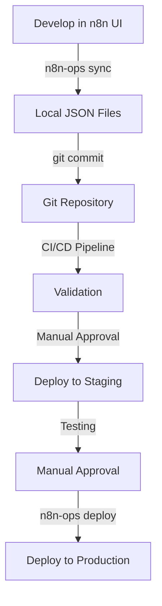

# n8n-ops Visual Quick Start Guide

## 🚀 Getting Started in 5 Minutes

This visual guide will help you get started with n8n-ops quickly and easily.

## Step 1: Installation

```bash
# Clone the repository
git clone https://gitlab.com/your-username/n8n-ops.git
cd n8n-ops

# Build the CLI
go build -o n8n-ops main.go

# Make it executable (Linux/macOS)
chmod +x n8n-ops
```

## Step 2: Run the Onboarding Wizard

```bash
./n8n-ops onboard
```

This will guide you through:
- Creating your project structure
- Configuring your n8n environments
- Setting up API keys
- Testing connections


## Step 3: Configure Your Environment

Create or edit `~/.n8n-ops.yaml`:

```yaml
environments:
  development:
    url: "http://localhost:5678"
    api_key_env: "N8N_API_KEY_DEV"
  staging:
    url: "https://n8n-staging.example.com"
    api_key_env: "N8N_API_KEY_STAGING"
  production:
    url: "https://n8n-prod.example.com"
    api_key_env: "N8N_API_KEY_PROD"
```

Set your environment variables in `.env`:

```
N8N_API_KEY_DEV=n8n_api_your_dev_key_here
N8N_API_KEY_STAGING=n8n_api_your_staging_key_here
N8N_API_KEY_PROD=n8n_api_your_prod_key_here
```

## Step 4: Sync Workflows from n8n

```bash
# Sync workflows from your development environment
./n8n-ops sync --env development
```


This will:
- Connect to your n8n instance
- Download all workflows
- Save them as JSON files in `./workflows/development/`

## Step 5: Validate Your Workflows

```bash
# Validate all workflows in the development directory
./n8n-ops validate ./workflows/development/
```


This checks:
- JSON syntax
- Workflow structure
- Node connections
- Business rules

## Step 6: Deploy to Another Environment

```bash
# First, do a dry run to see what will be deployed
./n8n-ops deploy --env staging --dry-run

# Then, deploy to staging
./n8n-ops deploy --env staging
```


## Step 7: Check Status

```bash
# Check the status of your workflows
./n8n-ops status --env staging
```


## Step 8: Use with Git

```bash
# Add workflows to Git
git add workflows/
git commit -m "Add initial workflows"
git push

# Check branch mapping
./n8n-ops branch current
```

## Common Workflow



## Command Reference

| Command | Description |
|---------|-------------|
| `n8n-ops onboard` | Interactive onboarding wizard |
| `n8n-ops tutorial` | Interactive tutorial |
| `n8n-ops sync --env <env>` | Sync workflows from n8n |
| `n8n-ops deploy --env <env>` | Deploy workflows to n8n |
| `n8n-ops validate <path>` | Validate workflow files |
| `n8n-ops status --env <env>` | Check workflow status |
| `n8n-ops branch list` | List branch mappings |
| `n8n-ops check --env <env>` | Check for changes |

## Need Help?

- Run `n8n-ops tutorial` for an interactive tutorial
- Run `n8n-ops --help` for command information
- Check the [Development Guide](DEVELOPMENT.md) for detailed documentation