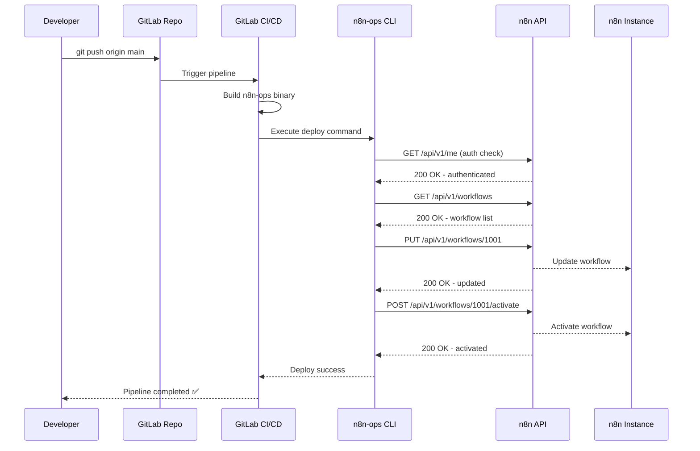

# Diagrama de Flujo: GitLab CI/CD ↔ n8n API

## 🔄 Arquitectura Completa

```
┌─────────────────┐    git push     ┌─────────────────┐
│   Developer     │ ──────────────► │   GitLab Repo   │
│                 │                 │                 │
└─────────────────┘                 └─────────────────┘
                                              │
                                              │ triggers
                                              ▼
                                    ┌─────────────────┐
                                    │ GitLab CI/CD    │
                                    │ Pipeline        │
                                    └─────────────────┘
                                              │
                                              │ executes
                                              ▼
                                    ┌─────────────────┐
                                    │   n8n-ops CLI   │
                                    │   (Go Binary)   │
                                    └─────────────────┘
                                              │
                                              │ API calls
                                              ▼
                            ┌─────────────────────────────────────┐
                            │           n8n Instances            │
                            │                                     │
                            │  ┌─────────┐ ┌─────────┐ ┌──────────┐ │
                            │  │   Dev   │ │ Staging │ │   Prod   │ │
                            │  │         │ │         │ │          │ │
                            │  └─────────┘ └─────────┘ └──────────┘ │
                            └─────────────────────────────────────────┘
```

## 📡 Flujo de API Calls Detallado

### Scenario: Deploy to Production



## 🎯 Comandos y sus API Calls

### 1. `n8n-ops sync --env production`
```bash
# GitLab CI/CD ejecuta:
./n8n-ops sync --env production --verbose

# El CLI internamente hace:
GET https://n8n-prod.tuempresa.com/api/v1/me
GET https://n8n-prod.tuempresa.com/api/v1/workflows
GET https://n8n-prod.tuempresa.com/api/v1/workflows/1001
GET https://n8n-prod.tuempresa.com/api/v1/workflows/1002
# ... por cada workflow
```

### 2. `n8n-ops deploy --env production`  
```bash
# GitLab CI/CD ejecuta:
./n8n-ops deploy --env production --verbose

# El CLI internamente hace:
GET https://n8n-prod.tuempresa.com/api/v1/me
GET https://n8n-prod.tuempresa.com/api/v1/workflows
PUT https://n8n-prod.tuempresa.com/api/v1/workflows/1001
POST https://n8n-prod.tuempresa.com/api/v1/workflows
POST https://n8n-prod.tuempresa.com/api/v1/workflows/1005/activate
```

### 3. `n8n-ops status --env production`
```bash
# GitLab CI/CD ejecuta:  
./n8n-ops status --env production

# El CLI internamente hace:
GET https://n8n-prod.tuempresa.com/api/v1/workflows
# Lee también base de datos local SQLite para historial
```

## 🔐 Autenticación por Ambiente

### Development Pipeline
```yaml
deploy-development:
  before_script:
    - export N8N_API_KEY="${N8N_DEV_API_KEY}"
    - export N8N_URL="${N8N_DEV_URL}"
  script:
    - ./n8n-ops deploy --env development
    # API calls → https://n8n-dev.tuempresa.com
```

### Staging Pipeline  
```yaml
deploy-staging:
  before_script:
    - export N8N_API_KEY="${N8N_STAGING_API_KEY}"
    - export N8N_URL="${N8N_STAGING_URL}" 
  script:
    - ./n8n-ops deploy --env staging
    # API calls → https://n8n-staging.tuempresa.com
```

### Production Pipeline
```yaml
deploy-production:
  before_script:
    - export N8N_API_KEY="${N8N_PROD_API_KEY}"
    - export N8N_URL="${N8N_PROD_URL}"
  script:
    - ./n8n-ops deploy --env production  
    # API calls → https://n8n-prod.tuempresa.com
  when: manual  # Require manual approval
```

## 📊 Ejemplo Real de Output

### GitLab CI/CD Log
```bash
$ ./n8n-ops deploy --env production --verbose

INFO[2025-07-22 16:00:00] Starting deployment to production            
INFO[2025-07-22 16:00:00] Connecting to n8n API                        url=https://n8n-prod.tuempresa.com
INFO[2025-07-22 16:00:01] Authentication successful                    user=api@tuempresa.com
INFO[2025-07-22 16:00:01] Found 3 local workflows to deploy           
INFO[2025-07-22 16:00:02] Checking workflow exists                     workflow="Customer Onboarding" id=1001
INFO[2025-07-22 16:00:02] Updating existing workflow                   workflow="Customer Onboarding" id=1001
INFO[2025-07-22 16:00:03] API call successful                          method=PUT url=/api/v1/workflows/1001 status=200
INFO[2025-07-22 16:00:03] Creating new workflow                        workflow="Loyalty Program"
INFO[2025-07-22 16:00:04] API call successful                          method=POST url=/api/v1/workflows status=201 id=1005
INFO[2025-07-22 16:00:04] Activating workflow                          workflow="Loyalty Program" id=1005
INFO[2025-07-22 16:00:05] API call successful                          method=POST url=/api/v1/workflows/1005/activate status=200

✅ Deployment completed successfully
   - Updated: 1 workflow
   - Created: 1 workflow  
   - Activated: 1 workflow
   - Total API calls: 6
   - Duration: 5.2s
```

## 🛠️ Variables de Configuración GitLab

### En GitLab Project → Settings → CI/CD → Variables:

```bash
# Development Environment
N8N_DEV_URL = https://n8n-dev.tuempresa.com
N8N_DEV_API_KEY = n8n_api_1234567890abcdef (Type: Variable, Protected: No)

# Staging Environment  
N8N_STAGING_URL = https://n8n-staging.tuempresa.com
N8N_STAGING_API_KEY = n8n_api_abcdef1234567890 (Type: Variable, Protected: Yes)

# Production Environment (Extra Protected)
N8N_PROD_URL = https://n8n-prod.tuempresa.com
N8N_PROD_API_KEY = n8n_api_fedcba0987654321 (Type: Variable, Protected: Yes, Masked: Yes)
```

La integración es **completamente automática**: haces `git push`, GitLab ejecuta tu CLI, el CLI llama las APIs de n8n, y tus workflows se despliegan automáticamente.